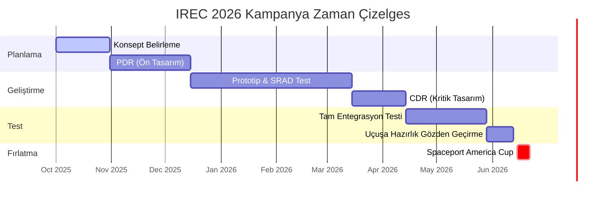

# 🚀 PROXIMA GÖREVİ | Spaceport America Cup Reposu

   

## 🌌 Görev Tanımı (Mission Statement)
**KTU Gökçen Roket Takımı**, dünyanın en büyük üniversiteler arası roket mühendisliği konferansı ve yarışması olan **Spaceport America Cup**'ta yarışmak üzere yeni nesil sondaj roketleri tasarlamaktadır.

Misyonumuz, bilimsel bir faydalı yükü hedef irtifaya taşıyabilen, itki ve aviyonik alanlarında **SRAD (Öğrenci Araştırması ve Geliştirmesi)** mükemmelliğini sergileyen **yüksek performanslı bir fırlatma aracı** tasarlamak, üretmek ve fırlatmaktır.

---

## 🏆 Kutsal Kase: IREC Teknik Rapor Referansları
*"İyi sanatçılar kopyalar, büyük sanatçılar çalar." - Pablo Picasso*

Aşağıdaki raporlar, Spaceport America Cup standartlarını yakalamamız için **incelenmesi zorunlu** kaynaklardır.

### 🚀 30,000 ft (İleri Kategori)
> *Karmaşık aerodinamik, süpersonik uçuş profilleri ve çok kademeli mimariler.*
*   **[McGill Rocket Team - Stella II (2018)](https://www.mcgillrocketteam.com/)** - *Kompozit Gövde & Aviyonik*
*   **[Waterloo Rocketry - Kraken of the Sky (2022)](https://waterloorocketry.com/)** - *Hibrit Motor & SRAD Sistemler*
*   **[Waterloo Rocketry - Shark of the Sky (2019)](https://waterloorocketry.com/)** - *Yüksek İrtifa Tasarımı*

### 🛸 10,000 ft (Orta Kategori)
> *Hassas iniş, COTS (Hazır) motor ustalığı ve faydalı yük entegrasyonu.*
*   **[McGill Rocket Team - Project Blanche (2018)](https://www.mcgillrocketteam.com/)** - *COTS Entegrasyon & Kurtarma*
*   **[Texas A&M SRT - Telemachus (2024)](https://tamusrt.org/)** - *Sentetik Açıklıklı Radar (SAR) Faydalı Yükü*
*   **[Texas A&M SRT - Daedalus (2017)](https://tamusrt.org/)** - *10k Hibrit Motor Başarısı*
*   **[Waterloo Rocketry - Vidar III (2017)](https://waterloorocketry.com/)** - *SRAD Hibrit Başlangıcı*

### 🧪 Deneysel & SRAD Teknolojiler
> *Özel itki sistemleri ve yenilikçi malzemelerle sınırları zorlamak.*
*   **[Waterloo Rocketry - Unexploded Ordnance (2018)](https://waterloorocketry.com/)** - *Kismet Hibrit Motor Serisi*
*   **[Clemson University - IREC 2024 Raporu](https://cecas.clemson.edu/rocket-engineering/)** - *Süreç Yönetimi ve Mühendislik Disiplini*
*   **[Clemson University Arşivi (2022-2023)](https://cecas.clemson.edu/rocket-engineering/)**

---

## 📂 Repo Yapısı (Repository Structure)
Bu repo, **ESRA** teslimat zaman çizelgesini yansıtacak şekilde düzenlenmiştir.

| Dizin | Açıklama | ESRA Teslimatı |
| :--- | :--- | :--- |
| **`docs/01_Milestones_&_Updates`** | İlerleme güncellemeleri ve büyük tasarım gözden geçirme sunumları. | **PDR, CDR** |
| **`docs/02_Technical_Report`** | "Kutsal Kase". Her sistemin detaylı dökümantasyonu. | **Teknik Rapor** |
| **`docs/03_Safety_&_SRAD`** | Risk değerlendirmesi, tehlike analizi ve operasyonel kontrol listeleri. | **Güvenlik Dökümanları** |
| **`docs/04_Subsystems_&_Payload`** | Aviyonik, İtki, Yapısal ve Kurtarma sistemlerine derinlemesine bakış. | **Tasarım Dökümanları** |
| **`analysis/`** | Python betikleri (RocketPy), OpenRocket dosyaları ve CFD sonuçları. | **Uçuş Analizi** |

---

## 🛠️ Teknoloji Yığını & Analiz Araçları

> [!TIP]
> **Önce Simülasyon:** Simüle edemediğimiz hiçbir şeyi uçurmayız.

*   **Yörünge:** [OpenRocket](https://openrocket.info/), [RocketPy](https://github.com/RocketPy-Team/RocketPy)
*   **CAD/CFD:** SolidWorks, Ansys Fluent
*   **PCB Tasarımı:** Altium Designer / KiCad
*   **Yazılım:** Python, C++ (Gömülü)

---

## 📅 Spaceport Yol Haritası

## 🤝 Katkıda Bulunma
Değişiklik önerme, hata bildirme ve Pull Request gönderme yönergeleri için `CONTRIBUTING.md` dosyasına bakın. Katı bir **"Özellik Başına Dal (Branch per Feature)"** iş akışı izliyoruz.

---
*KTU Gökçen Roket Takımı tarafından ❤️ ile oluşturuldu*
