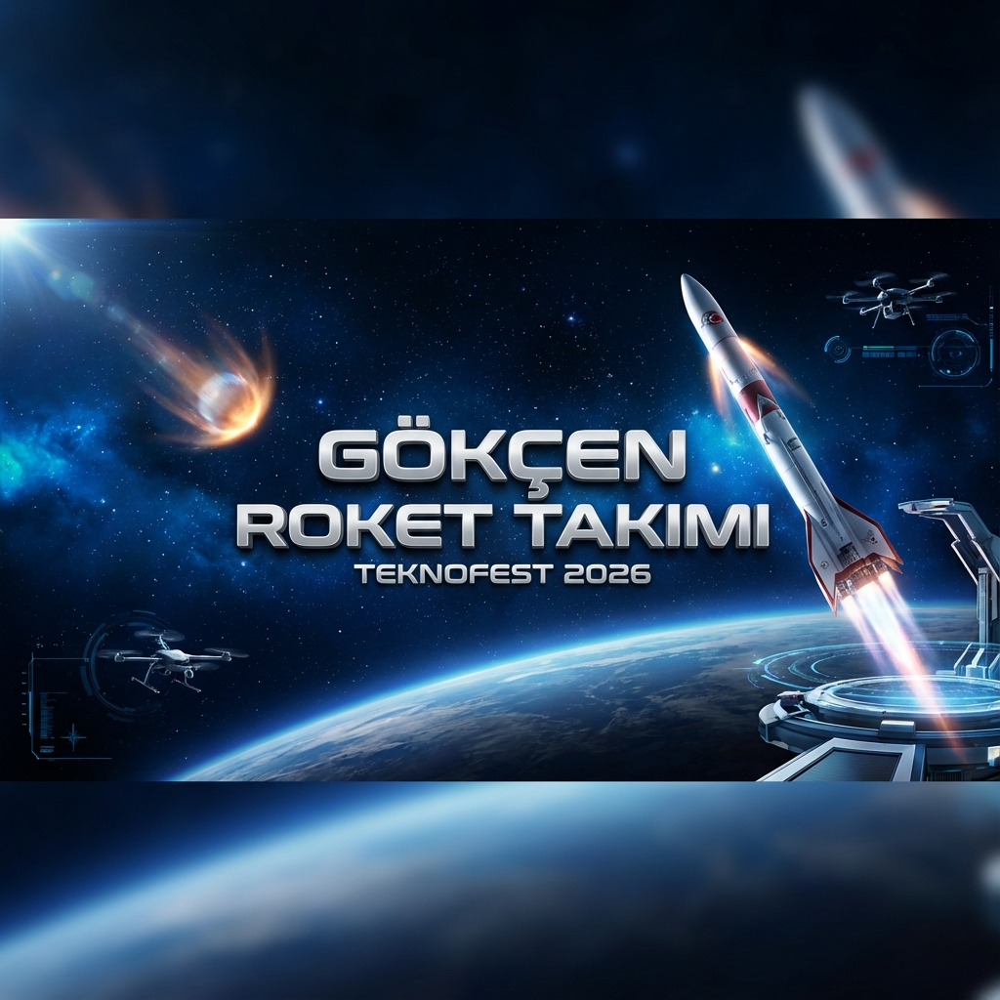
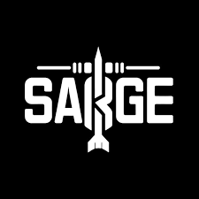
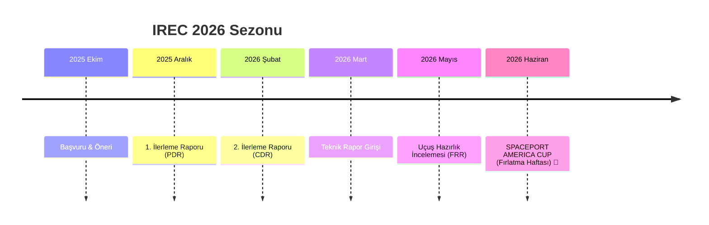

<div align="center">
  
  <br><br>
  
  

  # 📋 Spaceport America Cup (IREC) 2026 - Proje Dokümantasyonu
  ### Karadeniz Teknik Üniversitesi - Gökçen Roket Takımı

  [](https://www.soundingrocket.org/)
  [](https://github.com/bahattinyunus/ktu-rocket-irec/actions)
  [](https://www.soundingrocket.org/)
  [](LICENSE)

  <br>

  **"Geleceği mühendislikle inşa ediyoruz, New Mexico çöllerinde yıldızları hedefliyoruz."**

</div>

---

## 📚 Kaynaklar ve Referanslar

| 🇹🇷 Yerel Kaynaklar | 🌍 IREC & Uluslararası Kaynaklar |
| :--- | :--- |
| • [Gökçen Geçmiş Raporlar](pass_reports/)<br>• [Teknofest Arşivi](https://teknofest.org/tr/) | • **[ESRA (Exp. Sounding Rocket Assoc.)](https://www.soundingrocket.org/)**<br>• [RocketPy](https://github.com/RocketPy-Team/RocketPy)<br>• [OpenRocket](https://github.com/openrocket/openrocket)<br>• [Nakka Rocketry](https://www.nakka-rocketry.net/)<br>• [Apogee Rockets](https://www.apogeerockets.com/) |

---

> [!IMPORTANT]
> **📢 Takım Duyurusu**
>
> 1.  **Erişim:** Katkıda bulunmak için "Collaborator" yetkisi isteyin veya Pull Request açın.
> 2.  **Rapor Analizi:** Lütfen `pass_reports` klasöründeki eski IREC teknik makalelerini inceleyin.
> 3.  **Dil:** Yarışma gereği ana raporlama dili **İngilizce**'dir, ancak bu repo içindeki çalışma notları ve kılavuzlar **Türkçe** olabilir.

---

## 🛠️ Teknoloji Yığını
<div align="center">


</div>

---

## 📌 Depo Amacı
Bu repo, **KTÜ Gökçen Roket Takımı**'nın **2026 Spaceport America Cup (IREC)** katılımı için merkezi çalışma alanıdır. Tüm tasarım belgeleri, analiz raporları, uçuş simülasyonları ve aviyonik yazılımları burada barındırılır.

---

## 🚀 Spaceport America Cup (IREC) Hakkında

**Spaceport America Cup**, her yıl New Mexico, ABD'de düzenlenen dünyanın en büyük üniversiteler arası roket mühendisliği konferansı ve yarışmasıdır.

### 🏆 Kategoriler
Takımımız şu kategoriyi hedeflemektedir:
*   **Hedef İrtifa:** 10,000 ft (AGL) veya 30,000 ft (AGL)
*   **İtki Tipi:** COTS (Hazır Ticari Motor) veya SRAD (Öğrenci Araştırma ve Geliştirme)
*   **Mevcut Hedef:** **10,000 ft - COTS Katı Yakıtlı Motor** (Ön Karar)

### 📝 Zaman Çizelgesi (IREC 2026)
Yarışma, ESRA takvimine sıkı sıkıya bağlılık gerektirir:



### 🎯 Puanlama Kriterleri
*   **Proje Teknik Raporu:** 500 Puan (Tasarım doğruluğu, analiz, güvenlik).
*   **Uçuş Performansı:** 500 Puan (İrtifa doğruluğu, kurtarma başarısı, faydalı yük görevi).
*   **Bonus:** Sportiflik, Takım Ruhu, SRAD bileşenler.

---

## 📂 Dokümantasyon Yapısı (IREC Standardı)

```plaintext
├── 📂 assets              # Görseller, bannerlar, logolar
├── 📂 docs                # 🧠 Teknik Dokümantasyon
│   ├── 📂 00_admin                  # 📅 Bütçe, Takım Listesi, ESRA İletişimleri
│   ├── 📂 01_progress_updates       # 📝 PDR, CDR, Uçuş Hazırlık İncelemeleri
│   ├── 📂 02_technical_report       # 📄 Final Proje Teknik Raporu
│   ├── 📂 03_safety_and_operations  # ⚠️ Tehlike Analizi & Fırlatma Kontrol Listeleri
│   └── 📂 04_subsystems             # 🛠️ Tasarım & Analiz (İtki, Aviyonik...)
├── 📂 flight_data         # 📡 Telemetry logları & Simülasyon dosyaları (OpenRocket/RasAero)
├── 📜 CITATION.cff        # Akademik atıf
├── 📜 README.md           # Ana proje dosyası
└── 📜 LICENSE             # MIT Lisansı
```

### 📋 Önemli Belgeler
*   [🚀 Fırlatma Operasyon Kontrol Listesi](docs/03_safety_and_operations/launch_checklist.md)
*   [⚠️ Risk Değerlendirmesi](docs/03_safety_and_operations/risk_assessment.md)
*   [📄 Teknik Rapor Taslağı](docs/02_technical_report/README.md)

---

## 🤝 Katkıda Bulunma & İş Akışı
1.  **Haftalık Toplantılar:** Pazar günleri saat 20:00.
2.  **Belgeleme:** Tüm mühendislik kararları gerekçeleriyle birlikte `docs/` altında belgelenmelidir.
3.  **Birimler:** Tüm belgeler **Imperial & Metric** birimlerini (IREC gereksinimi) kullanmalıdır.

---

## 📞 İletişim
*   **Takım Kaptanı:** [İsim Soyisim] (email@ktu.edu.tr)
*   **Akademik Danışman:** [Ünvan İsim Soyisim]

<div align="center">
  <p>© 2026 Karadeniz Teknik Üniversitesi - Gökçen Roket Takımı</p>
</div>
