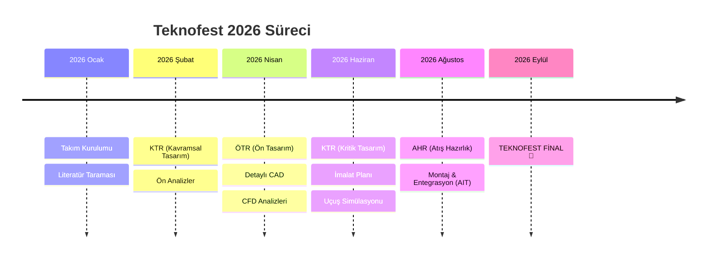



<div align="center">
  
  <br><br>
  
  

  # 📋 Teknofest 2026 Roket Takımı - Planlama ve Arşiv
  ### Karadeniz Teknik Üniversitesi - Gökçen Roket Takımı

  [](https://teknofest.org/tr/)
  [](https://github.com/bahattinyunus/teknofest-rocket-2026/actions)
  [](https://teknofest.org/tr/)
  [](LICENSE)

  <br>

  **"Göklerdeki istikbalimiz için planlı, disiplinli ve bilimsel çalışma."**

</div>

---

## 📚 Yararlı Kaynaklar (Resources)

| 🇹🇷 Yerli Örnekler | 🌍 Yabancı Kaynaklar |
| :--- | :--- |
| • [Atalay Roket](https://github.com/atalayroket)<br>• [Teknofest Yer İstasyonu](https://github.com/koesan/Teknofest_roket_Yer_istasyonu_yazilimi.git)<br>• [Teknofest Flight Software](https://github.com/denizetkar/TeknofestFlightSoftware)<br>• [Yer İstasyonu (Yunus Emre Tom)](https://github.com/yunusemretom/Yer-Istasyonu)<br>• [Atalay Aviyonik](https://github.com/atalayroket/atalay_aviyoniksistem) | • [Rocket Control](https://github.com/intensite/rocketcontrol)<br>• [NASA cFS](https://github.com/nasa/cFS)<br>• [ArduPilot](https://github.com/ArduPilot/ardupilot)<br>• [OpenRocket](https://github.com/openrocket/openrocket)<br>• [Mission Planner](https://github.com/ArduPilot/MissionPlanner)<br>• [PX4 Autopilot](https://github.com/PX4/PX4-Autopilot) |

### 🧠 Önerilen İleri Seviye Kaynaklar (Recommended by AI)

| 🔬 Simülasyon & Analiz | ⚡ Aviyonik & Gömülü Sistemler | 📚 Eğitim & Teori |
| :--- | :--- | :--- |
| • **[NASA OpenMCT](https://github.com/nasa/openmct)**<br>_(Görev kontrol arayüzü)_<br>• **[RocketPy](https://github.com/RocketPy-Team/RocketPy)**<br>_(6-DOF yörünge simülasyonu)_<br>• **[RASAero II](http://www.rasaero.com/)**<br>_(Aerodinamik analiz)_<br>• **[OpenRocket](https://openrocket.info/)**<br>_(Standart simülasyon)_ | • **[KiCad](https://www.kicad.org/)**<br>_(PCB Tasarım)_<br>• **[Teensy Rocket](https://github.com/PaulStoffregen/Teensy)**<br>_(Hızlı uçuş bilgisayarları)_<br>• **[ExpressLRS](https://github.com/ExpressLRS/ExpressLRS)**<br>_(Uzun menzil RC)_<br>• **[ArduPilot](https://ardupilot.org/)**<br>_(Otopilot ekosistemi)_ | • **[Nakka Rocketry](https://www.nakka-rocketry.net/)**<br>_(Motor teorisi)_<br>• **[BPS Space](https://www.youtube.com/c/BPSSpace)**<br>_(TVC ve kontrol)_<br>• **[Apogee Rockets](https://www.apogeerockets.com/Education/Newsletter-Archive)**<br>_(Teknik makaleler)_<br>• **[NASA Basics of Space Flight](https://solarsystem.nasa.gov/basics/chapter1-1/)** |

| 📏 Standartlar & El Kitapları | 🧮 Araçlar & Veritabanları | 🛠️ Mekanik & Üretim |
| :--- | :--- | :--- |
| • **[NASA Systems Engineering Handbook](https://www.nasa.gov/seh/)**<br>_(Sistem mühendisliği)_<br>• **[ECSS Standards](https://ecss.nl/)**<br>_(Avrupa Uzay Standartları)_<br>• **[FAA Amateur Rocketry](https://www.faa.gov/space/legislation_regulation_guidance)**<br>_(Güvenlik regülasyonları)_ | • **[ThrustCurve.org](https://www.thrustcurve.org/)**<br>_(Motor itki verileri)_<br>• **[Fruity Chutes Calculator](https://fruitychutes.com/help_guide/descent_rate_calculator.htm)**<br>_(Paraşüt/İniş hızı hesabı)_<br>• **[BurnSim](http://www.burnsim.com/)**<br>_(İç balistik tasarımı)_ | • **[Make It From](https://www.makeitfrom.com/)**<br>_(Malzeme özellikleri veritabanı)_<br>• **[NASA Spinoffs](https://spinoff.nasa.gov/)**<br>_(Teknoloji transferi örnekleri)_<br>• **[GrabCAD Rocketry](https://grabcad.com/library?page=1&time=all_time&sort=popular&query=rocketry)**<br>_(3D Model referansları)_ |

---

> [!IMPORTANT]
> **📢 Takım Duyurusu ve Görevlendirme**
>
> 1.  **Erişim:** Repo üzerinde çalışmak isteyenler kullanıcı adlarını ileterek "Collaborator" olabilir veya doğrudan PR (Pull Request) açabilirler.
> 2.  **Rapor Analizi:** `geçmis_raporlar` klasöründe dosyalar "1. kişi", "2. kişi" şeklinde gruplandırılmıştır.
>     *   **Görev:** Bir klasör seçin ve adını **kendi adınızla (Ad_Soyad)** değiştirin.
>     *   İçindeki 3 raporu inceleyip önemli noktaları ve analizlerinizi not alın.
>     *   Herkese kolay gelsin! 🚀

---

## 🛠️ Kullanılan Teknolojiler ve Araçlar
<div align="center">


</div>

---

## 📌 Depo Amacı
Bu repository, **KTÜ Gökçen Roket Takımı**'nın 2026 Teknofest Yarışması sürecindeki **tasarım, analiz, raporlama ve yönetim** belgelerini barındırır.
Burası takımın **hafızasıdır**. Her teknik karar, her analiz sonucu ve her önemli belge burada saklanır.

---

## 🚀 Yarışma Hakkında (Teknofest Roket Kategorisi)

**T3 Vakfı** ve **Roketsan** öncülüğünde düzenlenen bu yarışma, öğrencilerin uzay teknolojileri alanında yetkinlik kazanmasını hedefler.

### 🏆 Kategoriler
Takımımız **Yüksek İrtifa (High Altitude)** kategorisinde yarışmaktadır.
*   **Orta İrtifa:** 5.000 feet (yaklaşık 1.500m) hedef irtifa.
*   **Yüksek İrtifa:** 10.000 feet (yaklaşık 3.000m) hedef irtifa - *Bizim Hedefimiz*
*   **Zorlu Görev:** 10.000 feet + Değişken Faydalı Yük görevi.

### 📝 Değerlendirme Süreci
Yarışma süreci 4 temel rapordan oluşur. Her aşama elemeli sistemdir:



### 🎯 Puanlama Kriterleri
*   **Raporlar:** %40 (Mühendislik hesapları ve dokümantasyon kalitesi).
*   **Atış ve Kurtarma:** %40 (Roketin sağlıklı şekilde tepe noktasına ulaşması ve paraşütlerin açılması).
*   **Faydalı Yük:** %10 (Görevin başarıyla icra edilmesi).
*   **Özgünlük:** %10 (Yerli tasarım ve inovatif çözümler).

---

## 📂 Dokümantasyon Yapısı

Tüm teknik ve idari belgeler standartlara uygun olarak düzenlenmiştir:

```plaintext
├── 📂 assets              # Görseller, bannerlar ve logolar
├── 📂 docs                # 🧠 Tüm teknik dokümanlar
│   ├── 📂 education       # 🎓 Eğitim materyalleri (Rocketry 101)
│   ├── 📂 internal        # 🧮 İç hesaplamalar ve notlar
│   ├── 📂 operations      # 📋 Operasyonel kontrol listeleri (Checklists)
│   ├── 📂 management      # 📅 Bütçe, takvim ve toplantı notları
│   ├── 📂 templates       # 📄 Rapor şablonları (ÖTR, KTR)
│   └── 📂 subsystems      # 🛠️ Alt sistem tasarımları
├── 📂 geçmis_raporlar     # 📚 Analiz edilen eski raporlar
├── 📂 logs                # 📡 Telemetri ve uçuş logları
├── 📜 CITATION.cff        # Akademik atıf dosyası
├── 📜 SECURITY.md         # Güvenlik politikası
└── 📜 README.md           # Ana proje dosyası
```

### 📋 Operasyonlar (Safety First)
*   [🚀 Fırlatma Günü Prosedürleri (Launch Day)](docs/operations/checklist_launch.md)
*   [⚠️ Güvenlik Prosedürleri](docs/operations/safety_procedures.md)
*   [🛠️ Montaj Kontrol Listesi](docs/operations/checklist_assembly.md)

### 🛠️ Alt Sistemler
*   [🔥 İtki Sistemi (Propulsion)](docs/subsystems/propulsion.md)
*   [⚡ Aviyonik & Yazılım](docs/subsystems/avionics.md)
*   [🏗️ Yapısal & Mekanik](docs/subsystems/structure.md)
*   [🪂 Kurtarma Sistemi (Recovery)](docs/subsystems/recovery.md)
*   [📦 Faydalı Yük (Payload)](docs/subsystems/payload.md)

### 📊 Yönetim ve Arşiv
*   [Bütçe Takibi](docs/management/budget.md)
*   [Toplantı Tutanağı Şablonu](docs/management/meeting_notes_template.md)
*   [Geçmiş Raporlar](geçmis_raporlar/)

---

## 🤝 Takım İçi Kurallar
1.  **Toplantı Disiplini:** Her Pazar 20:00'de haftalık toplantı yapılır.
2.  **Belgeleme:** Yapılan her hesaplama ve araştırma `docs/` altına işlenir.
3.  **İletişim:** WhatsApp grubu ve bu depo üzerindeki "Issues" sekmesi kullanılır.

---

## 📞 İletişim

*   **Takım Kaptanı:** [İsim Soyisim] (email@ktu.edu.tr)
*   **Akademik Danışman:** [Ünvan İsim Soyisim]

<div align="center">
  <p>© 2026 KTÜ Gökçen Roket Takımı</p>
</div>
