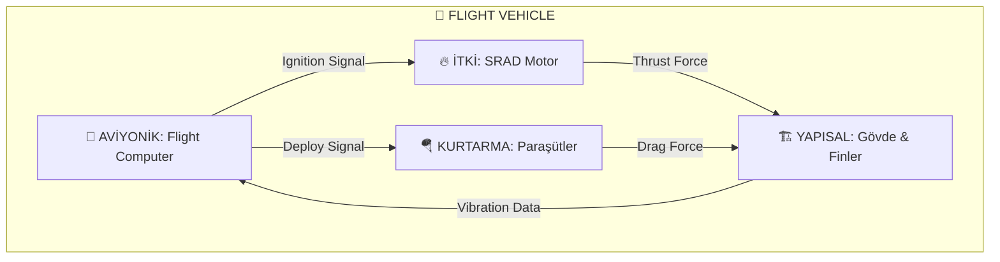

# 🦅 PROXIMA: THE IREC CODEX | KTU GÖKÇEN


> **"Vasatlık İhanettir."**
> Spaceport America Cup (IREC) bir öğrenci kulübü etkinliği değildir. Burası, mühendisliğin **Olimpiyatlarıdır**. Ya mükemmel olursunuz ya da çöle çakılırsınız.

<div align="center">

  

[**📜 MANİFESTO**](ROADMAP.md) • [**📚 KAYNAKLAR**](docs/RESOURCES.md) • [**📖 SÖZLÜK**](docs/GLOSSARY.md) • [**🧪 MALZEME**](docs/04_Subsystems_&_Payload/03_Aerostructures/Material_Properties.md) • [**📋 CHECKLISTS**](docs/03_Safety_&_SRAD/Checklists/) • [**🛡️ SAVAŞ KURALLARI**](CONTRIBUTING.md)

</div>

---

## ⚡ 0. MÜHENDİSLİK YEMİNİ (The Code)
Bu projeye adım atan herkes şu değişmez yasaları kabul eder:
1.  **Veri > Ego:** "Bence böyle olur" cümlesi yasaktır. "Simülasyon sonucu bu" cümlesi geçerlidir.
2.  **Fizik Affetmez:** Bir vida gevşekse, 10,000 feet'te o vida kopar. Roketiniz milyon dolarlık bir hurdaya döner.
3.  **Yazılmamışsa, Yapılmamıştır:** Testi video ile, tasarımı rapor ile kanıtlamazsanız, o işi yapmamış sayılırsınız.
4.  **Murphy Kanunu:** Ters gidebilecek her şey, en kötü zamanda (Fırlatma Anında) ters gider. Yedekleyin (Redundancy).

---

## 🏛️ 1. MİSYON VE OPERASYON ALANI
**Konum:** Spaceport America, New Mexico. **Düşman:** $Ma \approx 1.0$ şok dalgaları ve 45°C çöl sıcağı.
**Hedef:** 8.8 lb (4 kg) bilimsel faydalı yükü tam 30,000 ft irtifaya çıkarmak ve *tek parça* geri indirmek.

### 🏆 Yarışma Kategorileri (The Categories)
Spaceport America Cup (IREC), iki ana irtifa ve iki ana itki kategorisine ayrılır. Bizim hedefimiz **30k SRAD**:

| Kategori | İrtifa Hedefi | Motor Tipi | Açıklama |
| :--- | :--- | :--- | :--- |
| **10k COTS** | 10,000 ft AGL | Commercial (Hazır) | Başlangıç seviyesi. Hazır motor (Cesaroni, AeroTech) kullanılır. |
| **10k SRAD** | 10,000 ft AGL | Student R&D (Öğrenci) | Motoru öğrenciler tasarlar ve üretir. |
| **30k COTS** | 30,000 ft AGL | Commercial (Hazır) | Yüksek irtifa, ancak hazır motor güvenilirliği. |
| **30k SRAD** | 30,000 ft AGL | Student R&D (Öğrenci) | **En prestijli kategori.** Hem motor hem gövde öğrenci tasarımıdır. *Biz buradayız.* |

### 📐 Sistem Mimarisi (Architecture)
Bu roket tek bir vücut gibi çalışır. Alt sistemlerin etkileşimi:



---

## 🧬 2. MÜHENDİSLİK FELSEFESİ (Design-Build-Fly)
Biz bir "Teknoloji Kulübü" değiliz. Biz bir **Ar-Ge Organizasyonuyuz**.

### 1️⃣ Design (Tasarım)
*   **CAD:** SolidWorks (Mekanik) ve Altium (PCB) tasarımı bitmeden vida sıkılmaz.
*   **Simülasyon:** OpenRocket (Subsonic) ve RASAero (Supersonic) simülasyonları %95 doğrulukla yapılmalıdır.
*   **Review:** PDR (Preliminary Design Review) ve CDR (Critical Design Review) geçmeden üretime başlanmaz.

### 2️⃣ Build (Üretim)
*   **CNC & Torna:** Parçalar mikron hassasiyetinde işlenir.
*   **Kompozit:** Karbon fiber sarımı (Filament Winding) vakum altında kürlenir.
*   **Test:** Statik ateşleme testi (Static Fire) yapılmamış bir motor asla rokete takılmaz.

### 3️⃣ Fly (Uçuş)
*   **Checklist:** 50 maddelik kontrol listesi, pilotun kutsal kitabıdır.
*   **Analiz:** Uçuş sonrası SD kart verileri `analysis/` klasöründe Python ile işlenir ve simülasyonla karşılaştırılır.

---

## 💻 3. DIGITAL TOOLBELT (Araç Kutusu)
"Hesap makinesi kullanmayan mühendis, şairdir." Biz şair değiliz. Repoda gömülü Python araçlarını kullanın.

### 🛠️ Kurulum (Installation)
Tek komutla tüm mühendislik araçlarını kurun:
```bash
pip install -e .
pip install -r requirements.txt
```

### 🧮 Araçlar Nasıl Kullanılır?
| Araç | Komut | Ne Yapar? |
| :--- | :--- | :--- |
| **Paraşüt Boyutlandırma** | `python analysis/calculators/parachute_sizing.py` | Kütleye göre paraşüt çapını ve çarpma enerjisini (Joule) hesaplar. |
| **Link Budget (RF)** | `python analysis/calculators/link_budget.py` | Anten gücüne göre telemetri menzilini ve sinyal kalitesini ölçer. |
| **Thrust Analyzer** | `python analysis/calculators/thrust_analyzer.py` | Motor verisini (.eng) analiz edip grafiğini çizer. |

---

## 💀 3. FAILURE MODES (Neden Çakılacağız?)
Roketler bu yüzden düşer. Ezberleyin.

<details>
<summary>🚨 <b>Kritik Hata Senaryolarını Görüntüle</b> (Tıklayın)</summary>

### 🚩 Yapısal İflas (Structural Failure)
*   **Fin Flutter:** Kanatçıklar ses hızına yaklaşırken rezonansa girer ve kopar. *Çözüm: Karbon fiber + Modal Analiz.*
*   **Gövde Burkulması:** İtki kuvveti gövdeyi ezer. *Çözüm: Filament Winding.*

### 🚩 Aviyonik Kâbuslar
*   **RF Blackout:** GPS sinyali karbon fiberden çıkamaz. *Çözüm: Fiberglas burun konisi.*
*   **Pil Patlaması:** LiPo piller vakumda şişer. *Çözüm: Vakum testi yapılmış Li-Ion pil.*

### 🚩 İtki Sürprizleri (CATO)
*   **Nozzle Erozyonu:** Grafit nozzle erirse itki düşer. *Çözüm: Yüksek yoğunluklu grafit.*

</details>

---

## �️ 4. REPO HARİTASI (Directory Map)
Kaybolmayın. Bilgi burada:

```text
📂 ktu-rocket-irec/
├── 📂 analysis/                  # 🧠 BEYİN: Simülasyon ve Hesaplamalar
│   ├── 📂 calculators/           #    -> Python Araçları (Link, Paraşüt, İtki)
│   └── setup.py                  #    -> Kurulum dosyası
├── � docs/                      # 📚 KÜTÜPHANE: Dökümantasyon
│   ├── � 00_admin/              #    -> Bütçe, Organizasyon Şeması
│   ├── 📂 03_Safety_&_SRAD/      #    -> 🛡️ Risk Matrisi ve CHECKLISTLER
│   │   └── 📂 Checklists/        #       -> [Assembly] [Launch] [Recovery]
│   ├── 📂 04_Subsystems_/        #    -> 🔧 Teknik Tasarım Cetvelleri
│   ├── GLOSSARY.md               #    -> Sözlük (Apogee, CATO nedir?)
│   └── ...
├── 📜 ROADMAP.md                 # �️ Gelecek Planı
├── 📜 CONTRIBUTING.md            # 🤝 Katkı Kuralları
└── 📜 LICENSE                    # ⚖️ MIT Lisansı
```

---

## 🚀 5. OPERASYON: LAUNCH DAY
O gün geldiğinde panik yapmayın. **[Checklistleri](docs/03_Safety_&_SRAD/Checklists/)** kullanın.

| Saat (T-) | Event | Kritik Kontrol |
| :--- | :--- | :--- |
| **05:00** | 🌅 **Deployment** | 4L Su İç (Dehidrasyon = Hata). |
| **08:00** | 👮 **LCO Check** | Radyo Frekans Çakışması Kontrolü. |
| **09:15** | 💣 **Continuity** | Ateşleyici direnci < 50 Ohm olmalı. |
| **10:00** | 🔥 **IGNITION** | *Ad Astra Per Aspera.* |

---

## 📞 İLETİŞİM (Intel)
*   🌐 **HQ:** [gokcenrocket.org](https://gokcenrocket.org)
*   📧 **Secure Line:** contact@gokcenrocket.org

> *"Gelecek Göklerdedir."* - M.K. Atatürk

---
### ⚖️ Yasal Uyarı (Legal & Compliance)
*   **ITAR/EAR:** Bu proje ABD İhracat Kontrol Yasalarına tabi teknolojiler içerebilir. Paylaşırken dikkatli olun.
