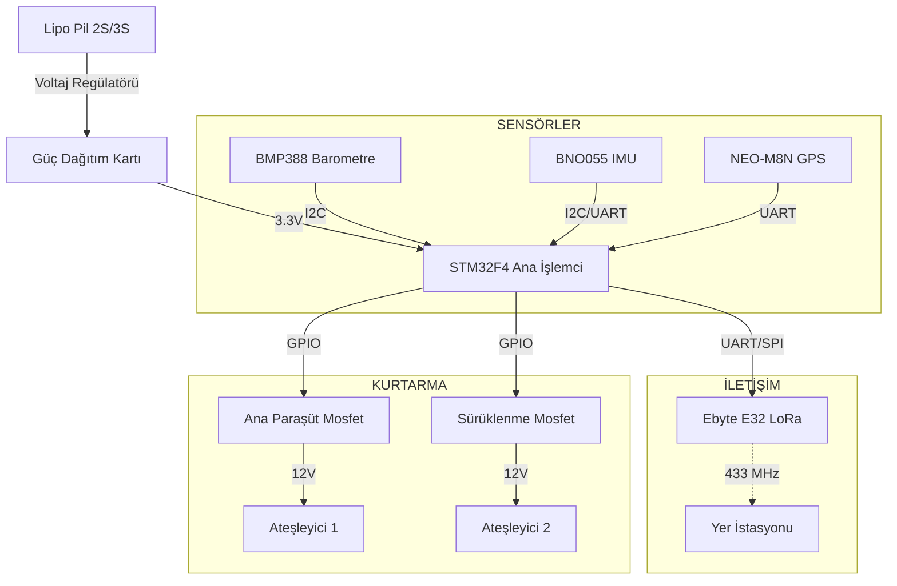

# ⚡ Aviyonik Alt Sistemi

## 🎯 Hedefler
- Ana Bilgisayar ve Yedek Bilgisayar mimarisi.
- Çift yönlü haberleşme (433 MHz LoRa) - 20km menzil hedefi.
- SD Kart Loglama (50 Hz).
- Sensör Füzyonu ve Durum Kestirimi (Kalman Filtresi).

## 💻 Yazılım Mimarisi (Software Architecture)
Roket uçuş yazılımı **Sonlu Durum Makinesi (Finite State Machine - FSM)** modeline dayanır. Bu model, roketin o anki durumuna göre farklı görevleri yerine getirmesini sağlar.

### Uçuş Durumları (Flight States)
1.  **IDLE (Bekleme):** Rampada bekleme, sensör kalibrasyonu.
2.  **ARMED (Hazır):** Güvenlik pimi çekildi, fırlatma komutu bekleniyor.
3.  **AGSOL (Ateşleme):** İvme algılandı (>3g), motor yanıyor.
4.  **COAST (Süzülme):** Motor sustu, kinetik enerji ile yükselme.
5.  **APOGEE (Tepe Noktası):** Hız ~0, irtifa maksimum. **1. Ayrılma (Sürüklenme Paraşütü).**
6.  **MAIN_DESCENT (Ana İniş):** 600m irtifada **2. Ayrılma (Ana Paraşüt).**
7.  **LANDED (İniş):** Hareket durdu, konum verisi gönderiliyor.

### Algoritmalar
#### Sensör Füzyonu (Kalman Filtresi)
Yüksek titreşimli ortamda doğru irtifa ve hız verisi elde etmek için **Barometre** ve **İvmeölçer (IMU)** verileri birleştirilir.
*   **Barometre:** Uzun vadede doğru irtifa verir, ancak anlık değişimlerde gürültülüdür.
*   **İvmeölçer:** Anlık değişimleri çok hızlı yakalar, ancak integrasyon hatası (drift) birikir.
*   **Çözüm:** *Complementary Filter* veya *Extended Kalman Filter (EKF)* ile iki sensörün güçlü yönleri birleştirilir.

## ⚡ Güç Bütçesi
| Bileşen | Voltaj (V) | Akım (mA) | Güç (W) |
| :--- | :--- | :--- | :--- |
| STM32F4 | 3.3 | 100 | 0.33 |
| LoRa Modülü | 3.3 | 120 (Tx) | 0.40 |
| Sensörler | 3.3 | 50 | 0.16 |
| GPS Modülü | 3.3 | 60 | 0.20 |
| **TOPLAM** | | **330 mA** | **1.09 W** |

## 📦 Malzeme Listesi (BOM)
- **Ana İşlemci:** STM32F407VG Discovery veya Black Pill
- **İletişim:** Ebyte E32 433T20D LoRa (Uzun menzil için)
- **Barometre:** BMP388 veya MS5611 (Yüksek hassasiyet)
- **IMU:** BNO055 veya MPU6050
- **GPS:** u-blox NEO-M8N

---

## ⚡ Bağlantı Şeması (Wiring Diagram)

